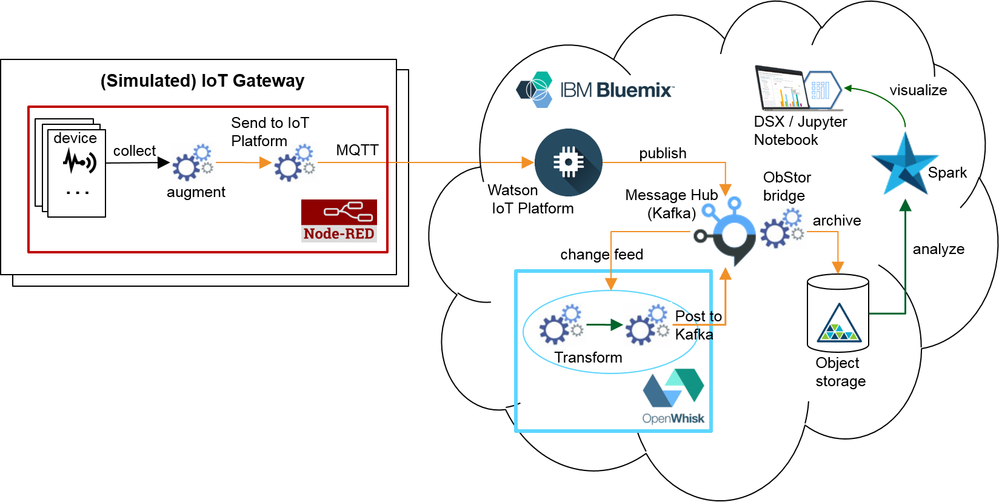

## TRANSIT: serverless TRANsformation of hiStorical IoT data

The TRANSIT project demonstrates the use of OpenWhisk for programmable transformation of messages in an IoT ingest pipeline comprising the Watson IoT Platform, Message Hub and Object Storage.

The architecture of TRANSIT is shown on the following diagram:

In a nutshell, the data flow is as follows:

1. IoT devices (simulated in Node-RED) send messages via MQTT to Watson IoT Platform.
2. Watson IoT Platform augments messages with metadata (e.g., timestamp) and forwards them to Message Hub.
3. An OpenWhisk feed retrieves messages from Message Hub (in small batches) and forwards them to an action sequence, comprising `transformation` and sending the results to Message Hub (different topic)
4. Message Hub archives messages from the above topic in batches to Object Storage (using a dedicated bridge)
5. The data in Object Storage can be retrieved on-demand from a Jupyter Notebook within the Spark Service (e.g., via Spark SQL interface)

In order to enable the above pipeline, the following configuration steps are needed:

1. IoT Platform service instance (with a given `orgId`): `device type`, one or more devices (`id` and `token` for each)
2. One or more devices (real or simulated), configured with the above `id`s and `token`s, configured to send MQTT messages to the `orgId` above, using a particular `event type`.
3. A Message Hub service instance with two topics, as well as IoT Platform historical storage extension configured to save messages to the first `topic` (for a given `event type` produced by the devices)
4. OpenWhisk trigger configured with Message Hub feed connecting to the above instance and topic
5. OpenWhisk action (provided in this project) to transform messages from the format provided by IoT Platform to format expected by Message Hub's bridge to Object Storage (metadata as flat fields in the message body rather than key).
6. OpenWhisk action (provided in this project) to post messages to the second Kafka topic, plus a package binding keeping the corresponding Message Hub credentials (including topic name)
7. OpenWhisk sequence concatenating the above two actions
8. OpenWhisk rule associating the above sequence with the above trigger
9. Object Storage service instance with a dedicated `container` (folder)
10. Message Hub bridge, configured to archive batches of messages from the second topic above into the Object Storage container above
11. Spark Service configured to work with the object storage container above
12. Jupyter notebook (provided in this project) to visualize the data in Object Storage using Spark SQL
